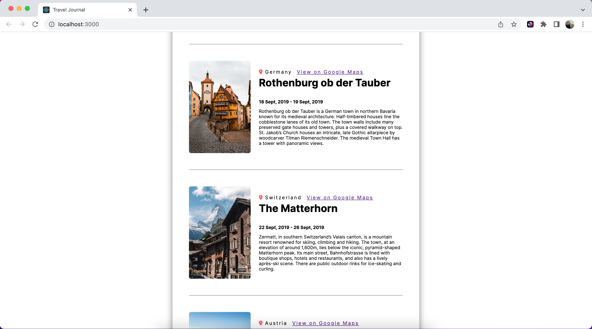

# Travel Journal using React

#### After every creation of a new project, I feel more and more confident that I will become a good programmer and someone that is highly valuable to a company and to myself. I am still unemployed at this point, but I know my skills and building portfolio will eventually shine through and employers will notice that. Of this I am sure! In the meantime, I continue my learning journey.

#### This project was a fun one, and incorporated HTML/CSS, JavaScript, and React. I was able to create a personal travel journal of places I have been and show it off, which was a great joy of mine, since travel is something I have always found happiness and excitement in!

#### Part of this project was to create all this data in a data.js object file, which represented a database, like in the real world, in order to populate my webpage. My project includes components for each part of my site and is then referenced and in my App.js file for the final presentation. A primary focus was to incorporate the map function to populate my data, which provides reusability, rather than hard coding information. The data.js file can easily be populated, added to or deleted, for ease of information to be updated.

#### Another thing I am proud of in this project is my ever-building skills of css design and layouts. I also utilized new fonts and icons, which I found online in fontawesome and google fonts. Referencing additional libraries is a great way to add style into my project and will be a lifelong benefit in all my future endeavors! My project can be seen using the link below to my Netlify page.

### https://myreact-travel-journal.netlify.app/
